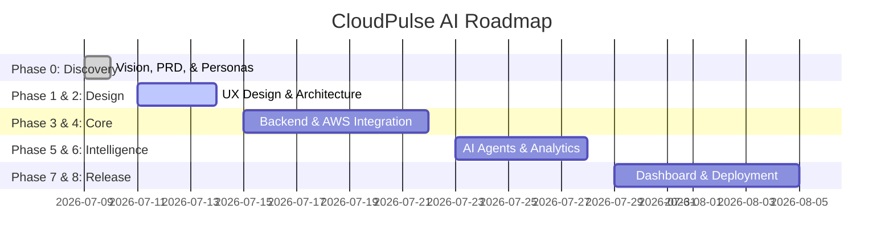

# CloudPulse AI - AI-Powered AWS Infrastructure Health Intelligence Platform

CloudPulse AI is a production-quality B2B SaaS platform designed to deliver intelligent, AI-powered health monitoring, cost optimization, and predictive operations for AWS infrastructure. Rather than acting as a static dashboard, CloudPulse AI operates as an autonomous agentic system that continuously evaluates AWS configurations, resource utilization, and cost patterns to recommend and execute optimizations.

---

## 🚀 Key Features

* **AI-Powered Infrastructure Health Intelligence**: Multi-agent orchestration (using LangGraph) to analyze EC2, RDS, EBS, S3, and IAM configurations.
* **Autonomous Cost Optimization**: Real-time analysis of Cost Explorer data combined with Compute Optimizer to find underutilized resources and suggest rightsizing.
* **Predictive Forecasting**: Forecasting CPU, memory, and cost utilization using AI agents.
* **Root-Cause Analysis (RCA) Copilot**: A conversational interface for DevOps and CTOs to debug infrastructure anomalies.
* **Enterprise-Ready Infrastructure**: Designed with infrastructure-as-code (Terraform), robust CI/CD pipelines, and high scalability.

---

## 🛠️ Technology Stack

| Layer | Technology |
| :--- | :--- |
| **Frontend** | React, TypeScript, Tailwind CSS, Vite |
| **Backend** | FastAPI (Python), Uvicorn |
| **Database** | PostgreSQL + `pgvector` (Vector Store for RAG) |
| **Queue & Worker** | Redis + Celery (Asynchronous tasks, reports, data collection) |
| **Cloud SDK** | `boto3` (AWS API Integration) |
| **Authentication** | JWT, OAuth2 (Secure B2B authentication) |
| **AI Engine** | LangGraph, OpenAI / Anthropic models |
| **IaC & Deployment** | Terraform, Docker, AWS ECS/Fargate, GitHub Actions |

---

## 📂 Repository Structure

```directory
cloudpulse_ai/
├── .github/             # GitHub Actions CI/CD workflows
├── docs/                # Product discovery & architecture documentation
├── backend/             # FastAPI backend application code
├── frontend/            # React + TypeScript frontend code
├── infrastructure/      # Terraform modules & environment configs
├── ai/                  # LangGraph multi-agent implementation
├── terraform/           # Core IaC modules
├── docker/              # Dockerfiles and docker-compose configurations
├── api/                 # OpenAPI specs and API client definitions
├── tests/               # Backend and frontend test suites
├── scripts/             # Utility and bootstrapping scripts
└── monitoring/          # Grafana dashboards and Prometheus configuration
```

---

## 📅 Roadmap & Phase Timeline



---

---

## 🎯 Current Project Phase

| Phase | Status | Dates | Key Deliverable |
|-------|--------|-------|-----------------|
| **Phase 0** | ✅ **COMPLETE** | Jul 1-9 | Product Discovery Docs |
| **Phase 1** | 🚀 **IN PROGRESS** | Jul 9-12 | Figma Designs + UX/UI |
| **Phase 2** | 📋 Next | Jul 12-15 | System Architecture Docs |
| Phase 3-8 | 📋 Queued | Jul 15 - Aug 6 | Implementation & Deployment |

**Total Timeline:** 4 weeks to production MVP 🚀

---

## 📖 Project Documentation

### Product Discovery (Phase 0) ✅ COMPLETE

All discovery documents are in the `docs/` folder:

* **[Vision Document](docs/vision.md)**: Product vision, core problems, and success metrics
* **[Product Requirements Document (PRD)](docs/prd.md)**: Specifications, features, and MVP scope
* **[Market Analysis & Pricing](docs/market_analysis.md)**: Competitive analysis, JTBD, and B2B SaaS pricing
* **[User Personas & Journeys](docs/personas.md)**: Target users (CTO, DevOps Lead, FinOps) and workflows
* **[Roadmap & MVP Release](docs/roadmap.md)**: Detailed timeline and milestones

### Development Roadmap & Build Plan (Phase 1-8)

**→ See [DEVELOPMENT-ROADMAP.md](docs/DEVELOPMENT-ROADMAP.md) for the complete build plan**

This document contains:
- ✅ What's been completed (Phase 0)
- 🚀 What's next (Phases 1-2)
- 📋 Complete implementation plan (Phases 3-8)
- 📁 Final repository structure
- 🎯 Success metrics for each phase
- ⏰ Week-by-week timeline

### Infrastructure & DevOps

* **[GitHub Setup Guide](README-GITHUB-SETUP.md)**: GitHub Codespaces, Actions, and GitHub-native development
* **CI/CD Pipeline**: `.github/workflows/ci-cd.yml` - Automated tests, builds, and deployments
* **Docker Setup**: `docker/docker-compose.yml` - Local development environment
* **[Architecture (HLD/LLD)](docs/architecture.md)**: System design and data flow.
