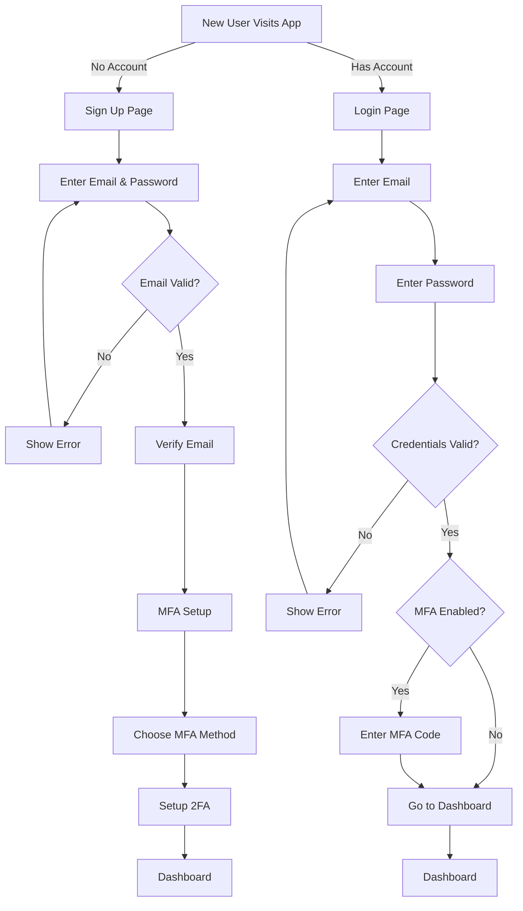
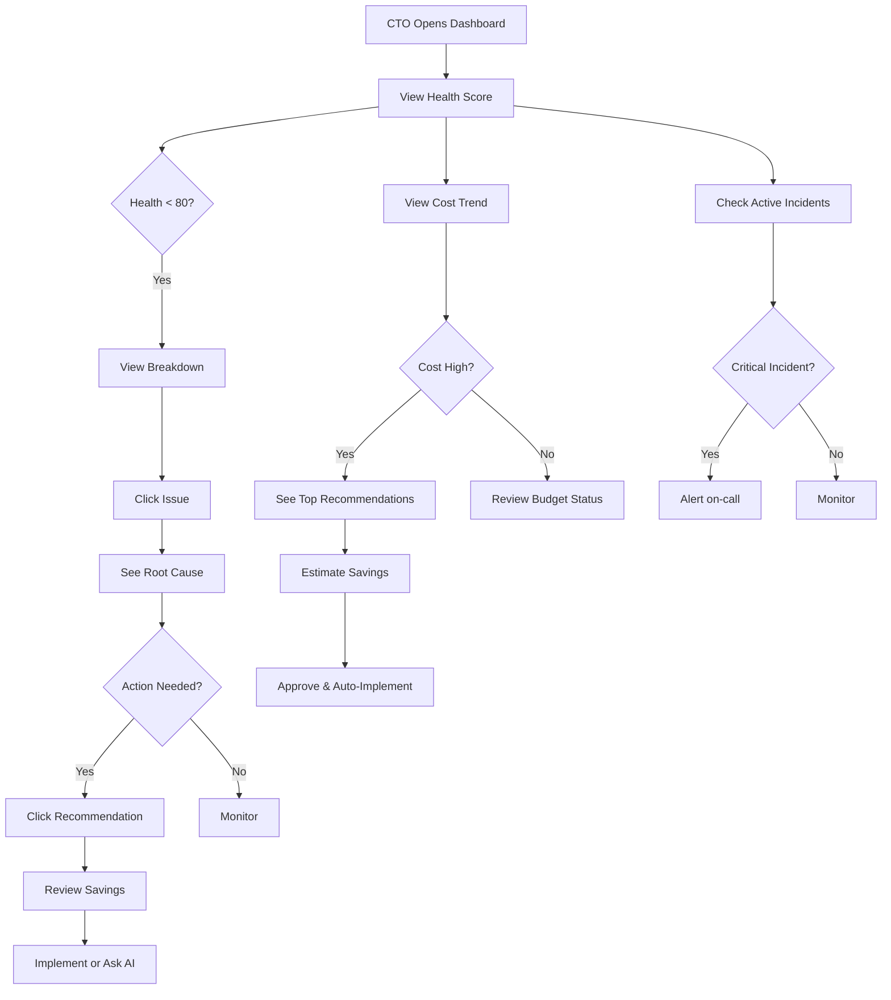
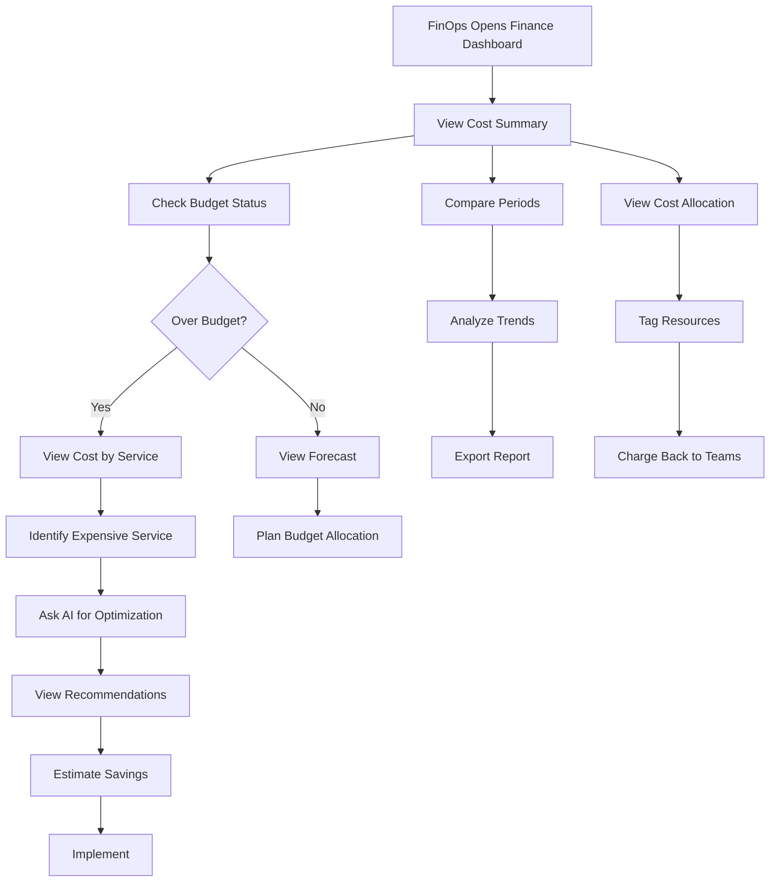
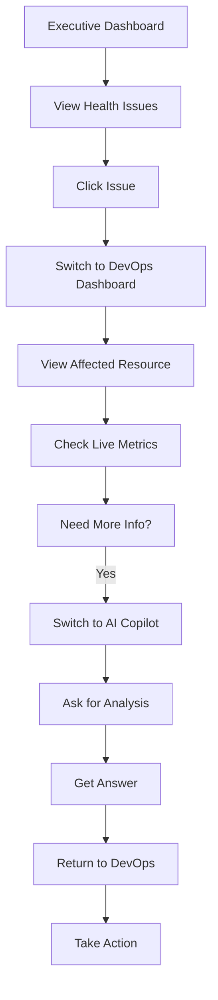
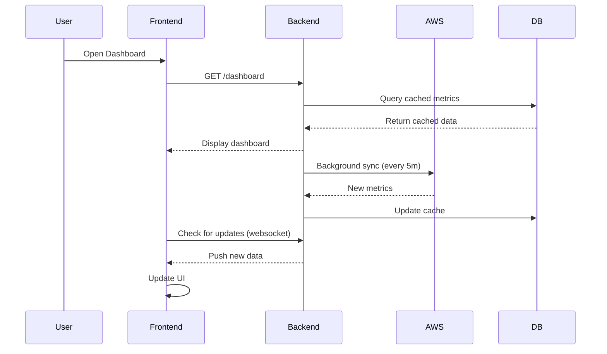
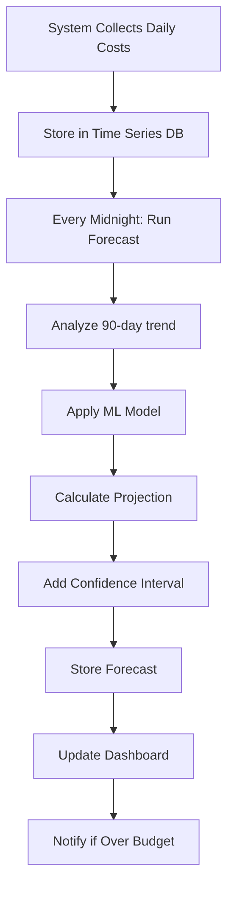
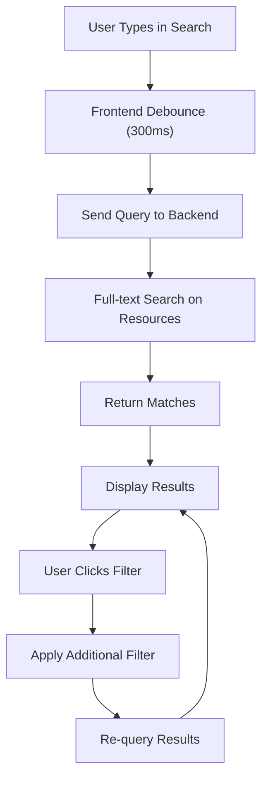
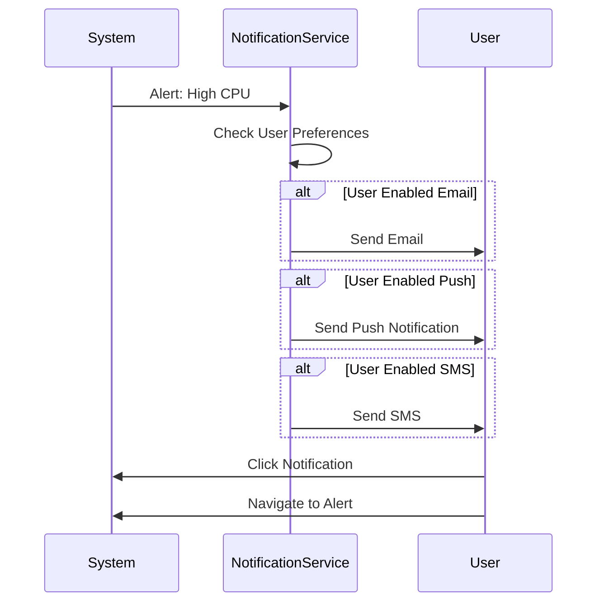
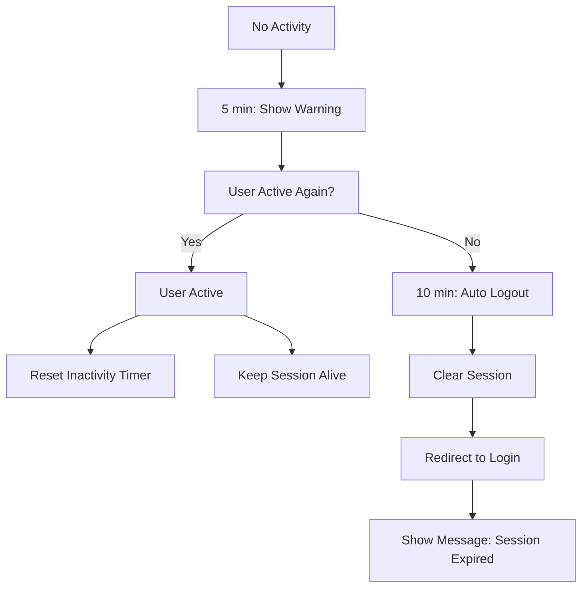

# CloudPulse AI - User Flows & Interaction Diagrams

**Phase 1 Deliverable** | User journey flows and system interactions
**Created:** 2026-07-09

---

## Authentication User Flow



---

## Executive Dashboard User Flow



---

## DevOps Dashboard User Flow

```mermaid
graph TD
    A["DevOps Engineer Opens"] --> B["View Resource List"]
    B --> C["Filter Resources"]
    C --> D["Select Resource"]
    D --> E["View Live Metrics"]
    E --> F{"Anomaly Detected?"}
    F -->|Yes| G["View Alerts"]
    G --> H["Check Root Cause"]
    H --> I["View Logs"]
    I --> J{"Issue Found?"}
    J -->|Yes| K["Create Incident"]
    J -->|No| L["Close Alert"]
    F -->|No| M["Monitor"]
    
    B --> N["View Alerts Stream"]
    N --> O["Click Alert"]
    O --> P["See Resource Details"]
    P --> Q{"Action Needed?"]
    Q -->|Yes| R["SSH/Console Access"]
    Q -->|No| S["Dismiss"]
```

---

## Cost Analysis User Flow



---

## AI Copilot User Flow

```mermaid
graph TD
    A["User Opens Copilot"] --> B["See Conversation History"]
    B --> C["Ask Question"]
    C --> D["AI Analyzes Infrastructure"]
    D --> E["Generate Response"]
    E --> F["Display with Charts/Code"]
    F --> G{"Satisfied?"]
    G -->|Yes| H["Save Conversation"]
    G -->|No| I["Ask Follow-up"]
    I --> D
    
    C --> J{"Request Runbook?"]
    J -->|Yes| K["Generate Runbook"]
    K --> L["Display Steps"]
    L --> M["Copy/Download"]
    
    C --> N{"Request Code?"]
    N -->|Yes| O["Generate Code Snippet"]
    O --> P["Copy to Clipboard"]
```

---

## Resource Onboarding Flow

```mermaid
graph TD
    A["New Org Signs Up"] --> B["Create Organization"]
    B --> C["Invite Team Members"]
    C --> D["Setup AWS Credentials"]
    D --> E{"IAM Role Created?"]
    E -->|No| F["Show IAM Policy"]
    F --> G["Create Role in AWS"]
    G --> D
    E -->|Yes| H["Test Connection"]
    H --> I{"Connection Valid?"]
    I -->|No| J["Show Error Logs"]
    J --> D
    I -->|Yes| K["Scan AWS Infrastructure"]
    K --> L["Index Resources"]
    L --> M["Calculate Health Scores"]
    M --> N["Generate Initial Recommendations"]
    N --> O["Ready for Use"]
```

---

## Recommendation Workflow

```mermaid
graph TD
    A["System Scans Resources"] --> B["Identify Optimization"]
    B --> C["Calculate Savings"]
    C --> D["Create Recommendation"]
    D --> E["Rank by Impact"]
    E --> F["Display in Dashboard"]
    
    F --> G["User Reviews"]
    G --> H{"Approve?"]
    H -->|Yes| I["Generate Implementation Plan"]
    I --> J{"Auto-Implement?"]
    J -->|Yes| K["Execute Changes"]
    K --> L["Monitor Results"]
    L --> M["Report Success"]
    J -->|No| N["Provide Manual Steps"]
    N --> O["User Implements"]
    O --> L
    H -->|No| P["Dismiss"]
```

---

## Alert & Incident Management Flow

```mermaid
graph TD
    A["CloudWatch/System"] --> B["Detect Anomaly"]
    B --> C["Create Alert"]
    C --> D["Notify DevOps"]
    D --> E["Engineer Views Alert"]
    E --> F["Click for Details"]
    F --> G["View Metrics & Logs"]
    G --> H{"Root Cause?"]
    H -->|Yes| I["Create Incident"]
    I --> J["Escalate if Critical"]
    J --> K["On-call Notified"]
    K --> L["Incident Response"]
    H -->|No| M["Ask AI Copilot"]
    M --> N["Get Suggestions"]
    N --> G
    
    L --> O["Resolve Issue"]
    O --> P["Close Incident"]
    P --> Q["Post Mortem"]
```

---

## Multi-dashboard Context Switching



---

## Data Sync & Refresh Strategy



---

## Real-time Metrics Update Flow

```mermaid
graph TD
    A["Dashboard Loaded"] --> B["Subscribe to Live Metrics"]
    B --> C["WebSocket Connection"]
    C --> D["Backend Streams Data"]
    D --> E["Update Frontend State"]
    E --> F["Re-render Charts"]
    F --> G["Show New Values"]
    
    G --> H["Every 30 seconds"]
    H --> I["Check for Threshold Breaches"]
    I --> J{"Threshold Exceeded?"]
    J -->|Yes| K["Highlight Alert"]
    J -->|No| L["Continue"]
    L --> H
```

---

## Cost Forecast Generation Flow



---

## Search & Filter Interactions



---

## Permission & Access Control Flow

```mermaid
graph TD
    A["User Logs In"] --> B["Fetch User Roles"]
    B --> C["Load Permission Matrix"]
    C --> D{"Can View Dashboard?"]
    D -->|No| E["Show 403 Forbidden"]
    D -->|Yes| F["Load Dashboard"]
    
    F --> G["Can Edit Resource?"]
    G -->|No| H["Disable Edit Button"]
    G -->|Yes| I["Enable Edit Button"]
    
    F --> J["Can View Costs?"]
    J -->|No| K["Hide Finance Tab"]
    J -->|Yes| L["Show Finance Tab"]
```

---

## Error Handling & Recovery

```mermaid
graph TD
    A["API Request"] --> B{"Success?"]
    B -->|Yes| C["Return Data"]
    C --> D["Update UI"]
    B -->|No| E{"Error Type?"]
    
    E -->|4xx - Client Error| F["Show User Message"]
    E -->|5xx - Server Error| G["Retry (exponential backoff)"]
    G --> H{"Retry Successful?"]
    H -->|Yes| C
    H -->|No| I["Show Error with Retry"]
    
    E -->|Network Error| J["Queue Request"]
    J --> K["Wait for Connection"]
    K --> L["Retry Queued Request"]
    
    F --> M["User Corrects Input"]
    M --> A
    
    I --> N["User Clicks Retry"]
    N --> A
```

---

## Notification Delivery System



---

## Mobile Responsive Interaction

```mermaid
graph TD
    A["Mobile User Opens App"] --> B{"Screen Size?"]
    B -->|< 640px| C["Load Mobile Layout"]
    B -->|641-1024px| D["Load Tablet Layout"]
    B -->|> 1024px| E["Load Desktop Layout"]
    
    C --> F["Hide Sidebar"]
    F --> G["Show Hamburger Menu"]
    G --> H["Tap Menu"]
    H --> I["Slide Menu In"]
    
    D --> J["Optional Sidebar"]
    E --> K["Fixed Sidebar"]
    
    C --> L["Stack Cards Vertically"]
    D --> M["2-Column Layout"]
    E --> N["3+ Column Layout"]
```

---

## Session & Timeout Management



These flows should guide the design and development of interactions in Figma and later implementation.
