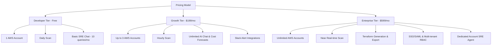

# Market Analysis & Pricing Strategy - CloudPulse AI

This document details the market landscape, competitive analysis, Jobs-To-Be-Done (JTBD) framework, and pricing strategy for CloudPulse AI.

---

## 1. Competitive Analysis
CloudPulse AI sits at the intersection of **Infrastructure Monitoring (APM)**, **Cloud Financial Management (FinOps)**, and **Generative AI Operations (AIOps)**.

| Competitor | Strengths | Weaknesses | CloudPulse AI Advantage |
| :--- | :--- | :--- | :--- |
| **Datadog / Dynatrace** | * Deep agent-based monitoring * Real-time dashboarding * Highly mature APM | * Extremely expensive pricing * Alert fatigue is common * No cost-remediation code generation | * Agentless setup (AWS API-driven) * AI summarizes and correlates alerts * Focus on cost-to-performance correlation |
| **CloudHealth / Cloudability** | * Robust cost reports * Enterprise budget forecasting | * No real-time health intelligence * Clunky UI * High barrier to entry for startups | * Designed for startups & SMEs * Dynamic, modern UX * Integrated SRE Chat Copilot |
| **AWS Native Tools** *(Compute Optimizer, Cost Explorer)* | * Native integration * Free or cheap | * Fragmented dashboarding * No multi-account consolidation * No interactive reasoning copilot | * Unified pane of glass * Cross-resource context reasoning * Direct Terraform generation |

---

## 2. Jobs-To-Be-Done (JTBD)
We apply the JTBD framework to align product development with user desires:

1. **The Cost Control Job**
   * *Situation*: *"When we receive a billing spike alert from AWS..."*
   * *Motivation*: *"...I want to immediately identify the exact resource causing the spike and obtain a safe remediation..."*
   * *Expected Outcome*: *"...so that we can maintain our runway and avoid manual budget reconciliation."*
2. **The Incident Resolution Job**
   * *Situation*: *"When a production service starts slowing down..."*
   * *Motivation*: *"...I want an AI agent to trace the bottleneck across database read operations, memory usage, and load balancer response times..."*
   * *Expected Outcome*: *"...so that I can fix the issue in minutes instead of hours and maintain customer SLAs."*
3. **The Governance Job**
   * *Situation*: *"As we scale our engineering team and spin up new environments..."*
   * *Motivation*: *"...I want to automatically audit our configurations against safety and cost best practices..."*
   * *Expected Outcome*: *"...so that we ensure zero orphaned resources and comply with cloud architecture frameworks without hiring full-time SREs."*

---

## 3. Pricing Strategy (B2B SaaS Model)
CloudPulse AI targets B2B customers using a tiered subscription model based on the complexity of the AWS infrastructure.

### In-App Expansion:
* **Usage-Based Add-on**: Accounts with more than 100 EC2/RDS active instances incur a charge of **$1.50 per instance/month** above the threshold. This aligns platform costs with the customer's infrastructure scale.
