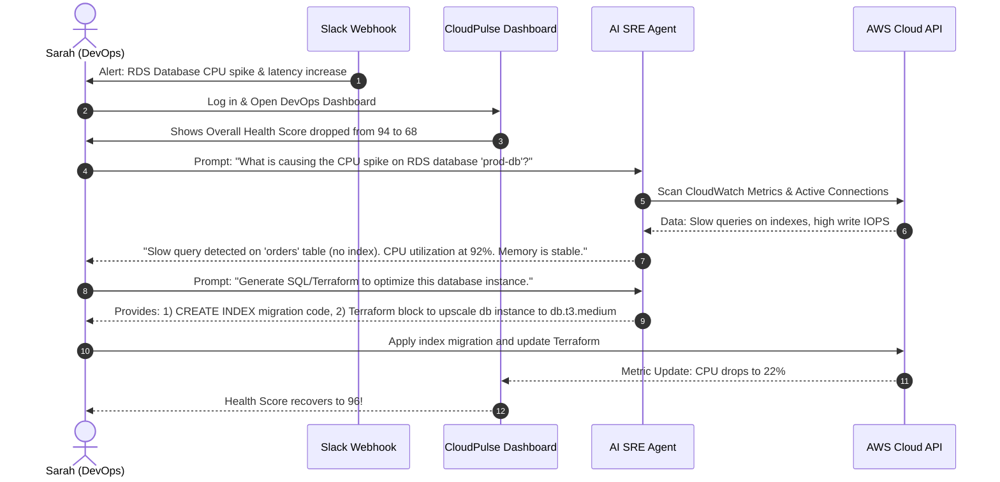

# User Personas & Journey Maps - CloudPulse AI

This document defines the key personas who use CloudPulse AI and details their operational journeys.

---

## 1. User Personas

### 1.1. Vikram - The Tech Executive (CTO / VP of Engineering)
* **Demographics**: 42 years old, background in software engineering, manages a team of 30 developers and DevOps engineers.
* **Goals**:
  * Ensure high system availability and security compliance for B2B enterprise customers.
  * Reduce overall cloud infrastructure burn rate without compromising application speed.
  * Gain high-level visibility into infrastructure cost vs. business usage growth.
* **Pain Points**:
  * Receives reports on cloud cost overruns *at the end* of the month when it is too late to fix.
  * Has no easy way to verify if his engineers are clean up their test environments.
  * Struggles to explain complex infrastructure incidents to the CEO or Board of Directors.

### 1.2. Sarah - The Platform Operator (Lead DevOps / SRE)
* **Demographics**: 31 years old, strong knowledge of AWS, Terraform, Docker, and Kubernetes.
* **Goals**:
  * Keep MTTR (Mean Time to Resolution) under 15 minutes for critical outages.
  * Automate repetitive infrastructure monitoring tasks.
  * Minimize alert fatigue from low-priority PagerDuty calls.
* **Pain Points**:
  * Spends hours digging through CloudWatch logs, APM traces, and VPC flow logs to correlate database issues with API slowness.
  * Writing cloud clean-up scripts takes time away from building new platform features.
  * Constantly gets blamed for AWS cost overruns but has no time to analyze idle resources.

### 1.3. Marcus - The Financial Optimizer (FinOps Lead)
* **Demographics**: 35 years old, background in corporate finance and systems engineering.
* **Goals**:
  * Maintain cloud spend within the allocated quarterly budgets.
  * Optimize AWS savings plans, reserved instances, and spot instances.
  * Allocate cloud costs accurately to individual engineering departments and products.
* **Pain Points**:
  * AWS Cost Explorer is too technical and lacks infrastructure performance context (e.g., does not show if a costly instance is actually idle).
  * Struggles to get DevOps engineers to prioritize cost-reduction tasks.

---

## 2. User Journey Maps

### 2.1. Sarah (DevOps Lead) - Incident Resolution & Rightsizing
The following flow illustrates how Sarah uses CloudPulse AI to debug a performance drop and rightsize an over-provisioned resource.

### 2.2. Marcus (FinOps Lead) - Cost Auditing & Actionable Savings
1. **Discover**: Marcus logs in on Monday morning. The FinOps Dashboard highlights a **Cost Efficiency Score of 58/100** and lists **$4,200 of potential monthly savings**.
2. **Analyze**: Marcus clicks on the "Zombie Resources" tab. CloudPulse AI lists 15 unattached EBS volumes (wasting $350/mo) and 4 RDS databases that have had zero active queries for 14 days ($1,800/mo).
3. **Collaborate**: Marcus uses the "Export Optimization Report" feature. It generates a markdown summary with reasons why these resources are safe to delete (e.g., *"Database test-db-2 has had zero connections since June 15"*).
4. **Action**: Marcus shares the report with Sarah. Sarah reviews it, verifies that the resources are indeed orphaned, and deletes them.
5. **Verify**: Next week, Marcus logs in and sees the Cost Efficiency Score rise to **89/100**, verifying that the changes saved the company $2,150/month in cloud spend.
