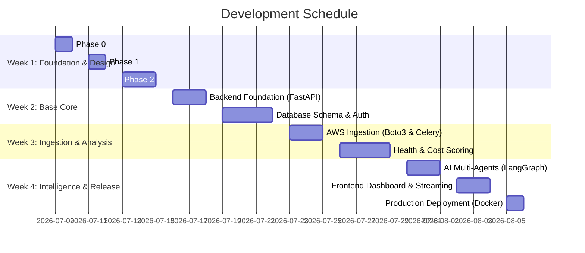

# Product Roadmap & MVP Definition - CloudPulse AI

This document establishes the development timeline, release milestones, and MVP prioritization framework for the CloudPulse AI platform.

---

## 1. MVP Definition (MoSCoW Framework)

To deliver a high-quality product within a 4-week timeline, we prioritize features using the MoSCoW method:

### Must Have (MVP v1.0)
* **AWS Metric Ingestion**: Read-only ingestion for EC2, RDS, EBS, S3, IAM, and Cost Explorer via Boto3.
* **Health and Cost Scoring Engines**: Algorithmic scoring based on resource utilization and pricing profiles.
* **LangGraph Multi-Agent Orchestrator**:
  * *Infrastructure Agent* (monitors capacity, uptime).
  * *Cost Agent* (finds cost anomalies, suggestions).
  * *Forecast Agent* (predicts CPU/memory/cost).
* **AI Chat Copilot**: Streaming chat interface for query resolution and Terraform script generation.
* **Role-Based Web Dashboards**: Dedicated UI views for Executive (CTO), DevOps, and FinOps users.
* **Secure JWT Authentication**: User sign-in with secure sessions.

### Should Have
* **Slack Webhook Notifications**: Real-time alerts for critical score drops or cost anomalies.
* **Report Exporting**: Generating downloadable markdown/PDF cost optimization summaries.
* **Vectorized Search (RAG)**: Storing cloud architecture documentation (e.g. AWS Well-Architected) in pgvector for the AI agent to reference.

### Could Have
* **Multi-Account Dashboard**: Aggregating data across multiple AWS Organization accounts.
* **Automated Schedule Cleanups**: Ability to schedule resource power-downs (e.g., stop Dev instances at 7 PM and start at 8 AM).

### Won't Have (Post-MVP)
* **Automated Write Actions**: Direct modification or deletion of AWS resources without user approval.
* **Multi-Cloud Integrations**: Support for GCP or Azure accounts.

---

## 2. Development Timeline & Milestones

The project will be built over a 4-week sprints structure:

### Milestone Releases:
1. **Milestone 1 (End of Week 1)**: Completion of all system blueprints. Includes HLD/LLD documents, ER diagrams, data flow schemas, and Figma high-fidelity dashboard layouts.
2. **Milestone 2 (End of Week 2)**: Database schema initialized, REST APIs functional with JWT auth, and mock AWS metrics.
3. **Milestone 3 (End of Week 3)**: Live connection with AWS using IAM roles. Asynchronous data collectors ingesting EC2/RDS/EBS config data. Health & cost efficiency algorithms running on a Celery scheduler.
4. **Milestone 4 (End of Week 4)**: LangGraph agents active, streaming SRE Chat working, React UI fully animated, Docker-Compose running local setup, and Terraform configuration complete for AWS ECS deployment.
